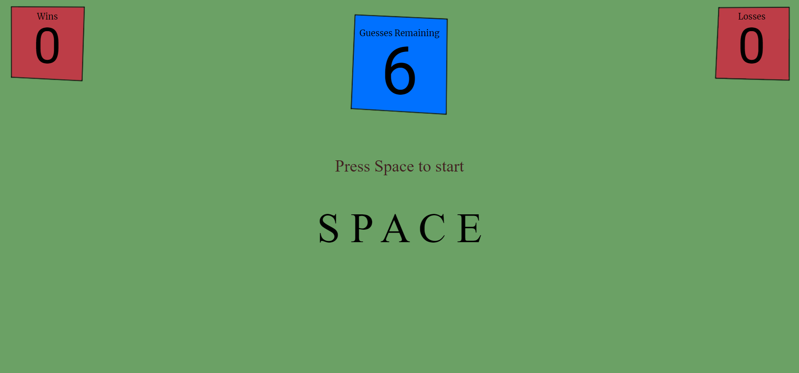
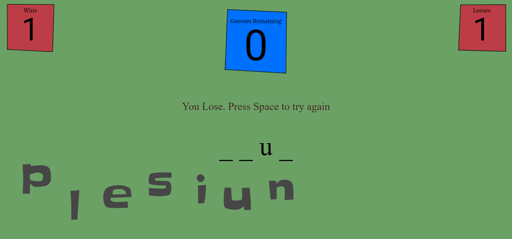

# Word Guess Game

## Purpose

This is hangman style game where you guess letters to try and figure out a hidden word. This was made for me to learn about HTML, CSS and Javascript. I also tried to add some randomness into the visual style to make it more interesting.

## Instructions

Press space to start the game, then press keys on your keyboard to try and guess the hidden word. Every time you press a key it will either reveal a letter in the word or be added to the used letters section. You will lose if you can't guess the word without making six mistakes.

## Images

## Author

Evan Jones

## Technologies Used

HTMl, CSS, and Javascript

## Contact

evanjones@fastmail.net
